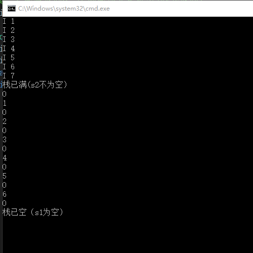
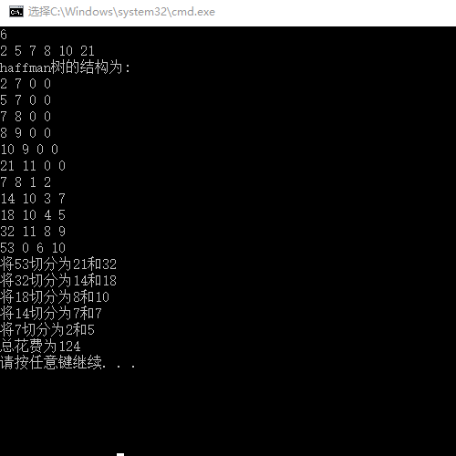
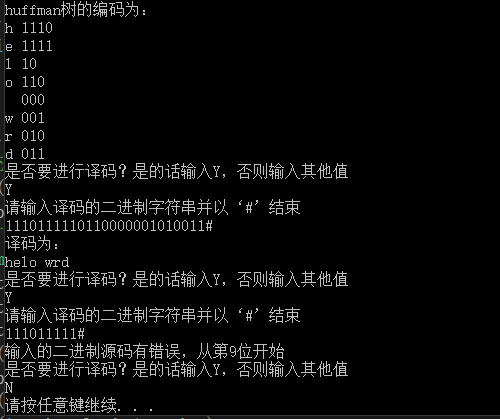

# 第二次上机作业

##### 17级 电子信息工程 王勇惠 17020022040

#### 一、实验目的

本次实验主要完成几项任务，第一了解堆栈先进后出的特点以及表示方法，了解队列先进先出的特点，通过两个堆栈来实现一个队列的效果，第二掌握静态霍夫曼树的作用、构造以及遍历方法，第三通过构建的哈夫曼树可以实现哈夫曼编码的压缩以及解压缩操作

#### 二、实验内容

1. 已知有两个堆栈S1和S2，请编写程序用这两个堆栈模拟出一个队列Q。（分析：假设堆栈s1和s2最大容量为N1和N2，队列的最大容量是多少）

2. 农夫将木头锯成N块，要求总花费最少，请编写程序打印锯木头的具体步骤和总花费值。（可以选择其它方法：如果不建立哈夫曼树，考虑堆排序实现优先级队列）

3. 对输入文字进行哈夫曼编码以达到压缩目的，再用哈夫曼编码进行译码解压缩。

#### 三、解题思路

1. 第一题由于堆栈先进后出的特点和队列先进先出的特点不同，所以考虑一个栈用来添加元素，一个栈用来输出元素，即向第一个栈中添加元素，先添加的元素在最下方，当需要输出时：

   * 先检查第二个栈是否为空，若不为空则输出元素
   * 若为空则检查第一个栈是否为空，若不为空则将第一个栈中的元素转移到第二个栈中在进行输出，否则输出”栈已空“

   这样虽然先入栈的元素在栈底，但是出栈的时候先入栈的元素到了第二个栈的栈顶，即做到先入先出，同理可知，在向栈中添加元素时：

   * 先检查第一个栈是否为满，若不满直接向栈中添加元素
   * 若栈满则检查第二个栈是否为空，若第二个栈为空则将第一个栈中的元素转移到第二个栈中，若第二个栈不为空，则输出“栈已满“

   经过分析可得，假设第一个栈的容量为N1，第二个栈的容量为N2，则N1<N2（若N1>N2，则当N1中元素满时无法转移到N2中），可存储的元素总个数为2*N1

   **注意：在第二个栈不为空时不可将第一个栈中的元素转移到第二个栈中，否则会扰乱队列顺序**

2. 第二题锯木头的成本与木头的长度成正比，要求总花费最少也就是说在知道最终锯成的各条木头的长度的情况下，锯木头时锯长木头的次数越少，花费越少，即长木头一开始锯出来，剩下的短木头最后锯，这和霍夫曼树权值小的在下面，权值大的结点在上面的道理等同，因此只需要将木头最终的长度构建成一棵霍夫曼树，然后将树遍历统计即可

3. 第三题首先构造霍夫曼树（过程和第二题完全类似），构造完之后将叶子结点逐个进行遍历来编码，遍历的结点的左孩子为0，右孩子为1，将编码后的内容放到相对应的code的指针中，然后进行译码，取输入的字符串与霍夫曼编码挨个比对，若比对失败则继续取字符串进行比对直到对比成功，之后输出huffman编码对应的字符，然后进行下一组比对（若超出了huffman的最长编码还未对比成功，则输出“第*位输入错误“的提示并提示用户重新输入）

#### 四、实验代码及注释

###### 第一题

```c
#include<stdio.h>
#include<stdlib.h>
#define S1 3//第一个栈的容量
#define S2 4//第二个栈的容量
typedef int StackData;
typedef struct {//顺序栈定义
	StackData *base;//栈底指针
	StackData *top;//栈顶指针
	int stacksize;//当前已分配的存储空间
}SeqStack;
int StackEmpty(SeqStack *s) {
	if (s->top == s->base)
		return 1;
	else
		return 0;
}//判断栈是否为空
int StackFull(SeqStack *s) {
	if (s->top - s->base >= s->stacksize)
		return 1;//判栈满，返回1
	else
		return 0;//否则返回0
}//判断栈是否满
void InitStack(SeqStack *s, int n) {
	s->base = (StackData *)malloc(n * sizeof(StackData));
	if (!s->base) exit;
	s->top = s->base;
	s->stacksize = n;
}//初始化栈并置空栈
void Convert(SeqStack *s1, SeqStack *s2) {
	while (s1->top != s1->base) {
		int temp;
		(s1->top)--;
		temp = *(s1->top);
		*(s2->top) = temp;
		(s2->top)++;
	}
}//若s2为空并且s1不为空，则将s1中的内容传给s2
void Push(SeqStack *s1, SeqStack *s2, StackData x) {
	if (StackFull(s1)) {
		if (StackEmpty(s2))   //若s1满栈，则判断s2是否为空，若为空则将s1中的内容
			Convert(s1, s2);  //转到s2当中，否则输出栈满
		else {
			printf("栈已满(s2不为空）\n");
			return;
		}
	}
	*(s1->top) = x;
	(s1->top)++;
}//进栈，插入元素x为新的栈顶元素
int Pop(SeqStack *s1, SeqStack *s2, StackData *x) {
	if (StackEmpty(s2)) {
		if (!StackEmpty(s1)) { //若s2为空栈，则判断s1是否为空，若s1不为空，则将s1的
			Convert(s1, s2);   //内容转移到s2当中，否则输出栈空
			(s2->top)--;
			*x = *(s2->top);
		}
		else {
			printf("栈已空（s1为空）\n");
			return 0;
		}
	}
	else {
		(s2->top)--;
		*x = *(s2->top);
	}
	printf("%d\n", *x);
	return 1;
}//出栈，若栈空返回0，否则栈顶元素推出到x并返回1
int main()
{
	SeqStack stack1, stack2;
	InitStack(&stack1, S1);
	InitStack(&stack2, S2);//初始化栈s1和s2
	char ch;
	while (scanf("%c", &ch) != EOF) {
		if (ch == 'I') {//若标志字符ch为‘I'则入栈
			int number1;
			scanf("%d", &number1);
			Push(&stack1, &stack2, number1);
			getchar();
		}
		else if (ch == 'O') {//若标志字符ch为'O'则出栈
			int number2;
			Pop(&stack1, &stack2, &number2);
			getchar();
		}
		else
			printf("输入错误，请重新输入\n");
	}
	return 0;
}
```

###### 第二题

```c
#include<stdio.h>
#define m_m 10//木头结点的个数
#define n_n 2*m_m-1//霍夫曼树节点的个数
typedef struct {
	int node;//代表结点的木头长度
	int parent;
	int lchild;
	int rchild;
}HTree, Huffmantree[n_n + 1];
void select(Huffmantree HT, int n, int *s1, int *s2) {
	int temp1, temp2;
	int min = 1000;
	for (int i = 1; i <= n; i++) {
		if (HT[i].parent == 0 && HT[i].node < min) {
			min = HT[i].node;
			temp1 = i;
		}
	}//寻找第一个最小值
	*s1 = temp1;
	min = 1000;
	for (int i = 1; i <= n; i++) {
		if (HT[i].parent == 0 && HT[i].node < min&& i != *s1) {
			min = HT[i].node;
			temp2 = i;
		}
	}//寻找第二个最小值
	*s2 = temp2;
}//求哈夫曼树中最小的两项以合并
void CreatHTree(Huffmantree HT, int money[], int n) {
	for (int i = 1; i <= n; i++) {
		HT[i].node = money[i];
		HT[i].lchild = 0;
		HT[i].rchild = 0;
		HT[i].parent = 0;
	}//初始化霍夫曼树的前n项
	int m = 2 * n - 1;
	for (int i = n + 1; i <= m; i++) {
		HT[i].node = 0;
		HT[i].lchild = 0;
		HT[i].rchild = 0;
		HT[i].parent = 0;
	}//将霍夫曼树的后n-1项初始化
	int s1, s2;
	for (int i = n + 1; i <= m; i++) {
		select(HT, i - 1, &s1, &s2);
		HT[i].node = HT[s1].node + HT[s2].node;
		HT[s1].parent = i;
		HT[s2].parent = i;
		HT[i].lchild = s1;
		HT[i].rchild = s2;
	}//构建霍夫曼树
}//初始化霍夫曼树
int main() {
	int N, money[m_m];
	scanf("%d", &N);
	for (int i = 1; i <= N; i++)
		scanf("%d", &money[i]);//输入切割后每个木头的长度
	Huffmantree HT;
	CreatHTree(HT, money, N);
	printf("haffman树的结构为:\n");
	for (int i = 1; i <= 2 * N - 1; i++)
		printf("%d %d %d %d\n", HT[i].node, HT[i].parent, HT[i].lchild, HT[i].rchild);
	int sum = 0;
	for (int i = 2 * N - 1; i >= N + 1; i--) {
		printf("将%d切分为%d和%d\n", HT[i].node, HT[(HT[i].lchild)].node, HT[(HT[i].rchild)].node);
		sum += HT[i].node;
	}//输出切割过程
	printf("总花费为%d\n", sum);
	return 0;
}
```

###### 第三题

```c
#include<stdio.h>
#include<stdlib.h>
#define m_m 10
#define n_n 2*m_m-1
typedef struct {
	char letter, *code;//字符，编码
	int node;
	int parent;
	int lchild;
	int rchild;
}HTree, Huffmantree[n_n + 1];
int strlen(char* str){
	int len = 0;
	while (*str++ != '\0')
		++len;
	return len;
}//求字符串的长度
int strcmp(char* s, char* t) {
	while (*s&&*t&&*s == *t) {
		++s;
		++t;
	}
	return (*s - *t);
}//比较s和t的大小，返回s和t第一个不同的字符的差值
void select(Huffmantree HT, int n, int *s1, int *s2) {
	int temp1, temp2;
	int min = 10000;
	for (int i = 0; i < n; i++) {
		if (HT[i].parent == 0 && HT[i].node < min) {
			min = HT[i].node;
			temp1 = i;
		}
	}//寻找第一个最小值
	*s1 = temp1;
	min = 10000;
	for (int i = 0; i < n; i++) {
		if (HT[i].parent == 0 && HT[i].node < min&& i != *s1) {
			min = HT[i].node;
			temp2 = i;
		}
	}//寻找第二个最小值
	*s2 = temp2;
}//求哈夫曼树中最小的两项以合并
void CreatHTree(Huffmantree HT, int s[], char ss[], int n) {
	for (int i = 0; i < n; i++) {
		HT[i].letter = ss[i];
		HT[i].node = s[i];
		HT[i].lchild = 0;
		HT[i].rchild = 0;
		HT[i].parent = 0;
	}//将霍夫曼树的前n项初始化
	int m = 2 * n - 1;
	for (int i = n; i < m; i++) {
		HT[i].letter = '#';
		HT[i].node = 0;
		HT[i].lchild = 0;
		HT[i].rchild = 0;
		HT[i].parent = 0;
	}//将霍夫曼的后n-1项初始化
	int s1, s2;
	for (int i = n; i < m; i++) {
		select(HT, i, &s1, &s2);
		HT[i].node = HT[s1].node + HT[s2].node;
		HT[s1].parent = i;
		HT[s2].parent = i;
		HT[i].lchild = s1;
		HT[i].rchild = s2;
	}//构建霍夫曼树
}//初始化霍夫曼树
void CreatHTreecode(Huffmantree HT, int n) {
	char **cd = (char**)malloc(sizeof(char*)*n);
	for (int i = 0; i < n; i++)
		cd[i] = (char*)malloc(sizeof(char)*n);
	int i;
	int start;
	for (i = 0; i < n; i++) {
		cd[i][n - 1] = '\0';   //从右向左存放编码
		start = n - 1;
		int c = i;
		int p = HT[i].parent;
		while (p != 0) {
			--start;
			if (HT[p].lchild == c)
				cd[i][start] = '0';
			else
				cd[i][start] = '1';
			c = p;
			p = HT[p].parent;
		}//存放霍夫曼编码后的值
		int j, k = 0;
		HT[i].code = (char*)malloc(sizeof(char)*n);
		for (j = start; cd[i][j] != '\0'; j++)
			HT[i].code[k++] = cd[i][j];//将霍夫曼编码后的值对应放到霍夫曼树中
		HT[i].code[k] = '\0';
	}
	return;
}//霍夫曼编码
void HuffmanTree_decode(Huffmantree HT, char ss[], int n, int sum) {
	char sen[100];
	char temp[50];
	int t = 0;
	int s = 0;
	int pos = 0;
	for (int i = 0; i<sum - 1; i++) {
		temp[t++] = ss[i];     //读取字符
		temp[t] = '\0';        //有效字符串结束
		for (int j = 0; j<n; j++) {        //依次与所有字符编码开始匹配
			if (!strcmp(HT[j].code, temp)) { //匹配成功
				sen[s++] = HT[j].letter;    //将编码对应字符保存到sen中
				pos += t;
				t = 0;          //t置空
				break;
			}
		}
	}
	if (t == 0) {     //t如果被置空了，表示都匹配出来了，打印译码
		sen[s] = '\0';
		puts("译码为：");
		printf("%s\n", sen);
	}
	else                             //t如果没有被置空 ， 源码无法被完全匹配
		printf("输入的二进制源码有错误，从第%d位开始\n", pos + 1);
}//霍夫曼解码
int main() {
	char str[100];//存放要编码的字符串
	char ss[m_m];//存放字符串中的统计项
	int s[m_m];//存放字符串中字符的权值
	int n = 0, j;
	gets_s(str);//输入字符串
	int len = strlen(str);
	for (int i = 0; i < len; i++) {
		for (j = 0; j < n; j++) {
			if (ss[j] == str[i]) {
				s[j] += 1; break;
			}
		}
		if (j >= n) {
			ss[n] = str[i];
			s[n] = 1;
			n++;
		}
	}//统计字符和对应的权值
	for (int i = 0; i<n; i++) {
		printf("字符：%c，权值：%d\n", ss[i], s[i]);
	}//打印字符及对应的权值
	Huffmantree HT;
	CreatHTree(HT, s, ss, n);//构建霍夫曼树
	CreatHTreecode(HT, n);//对霍夫曼树进行编码
	printf("huffman树的结构为:\n");
	for (int i = 0; i <2 * n - 1; i++)//打印huffman_tree
		printf("%c %d %d %d %d\n", HT[i].letter, HT[i].node, HT[i].parent, HT[i].lchild, HT[i].rchild);
	puts("huffman树的编码为：");
	for (int i = 0; i < n; i++)
		printf("%c %s\n", HT[i].letter, HT[i].code);//输出huffman编码
	while (1) {
		puts("是否要进行译码？是的话输入Y，否则输入其他值");
		char ch;
		scanf("%c", &ch);
		getchar();
		if (ch == 'Y' || ch == 'y')
			NULL;
		else
			break;
		puts("请输入译码的二进制字符串并以‘#’结束");
		int sign = 1;//判断是否输入正确的字符‘1’‘0’或‘#’
		int sum = 0;//计数输入的总字符数
		int symbol = 1;//判断是否输入结束
		char string[100];
		while (symbol) {
			char sss;
			scanf("%c", &sss);
			string[sum++] = sss;
			if (sss != '1'&&sss != '0'&&sss != '#')
				sign = 0;
			if (sss == '#') {
				symbol = 0;
			}
		}
		string[sum] = '\0';
		if (sign == 1)
			HuffmanTree_decode(HT, string, n, sum);
		else
			puts("输入有误");
		getchar();//接受换行符，开始下一轮的译码
	}
	return 0;
}

```


#### 五、输入输出说明及截图

1. 第一题分别用“I+数字”和“O”的形式表示堆栈输入和输出元素，当栈已满时用“I+数字”命令会有栈满的提示，当栈空时用”O“命令会有栈空的提示



2. 第二题输入锯成N块木头，紧跟着输入N块木头每一块的长度（假设木头长度与花费是1：1的关系），最后输出huffman树的结构以及锯木头的具体步骤和总花费。



3. 第三题首先输入要编码的字符串，例如”hello world“，紧跟着输出字符串中每个字符对应的权值，huffman树的结构以及huffman编码，之后程序会提示是否要进行译码，输入y之后按照提示输入一串要译码的字符，例如”1110、、、“，程序会根据之前的huffman编码来进行译码操作，若译码出现错误会提示用户从第几位输入出现错误




#### 六、实验收获总结

###### 第一题

1. 通过第一题对堆栈和队列有了更好的理解，原来堆栈还可以当作队列来应用，再写程序时发现如果将堆栈改为队列来使用，那么PUSH和POP函数需要经过一定的修改，因为此时是两个堆栈共同实现，所以PUSH和POP函数中的参数需要多加一个堆栈
2. 按照题目所设置的输入和输出来看，每次输入/输出之后都会有一个换行符，换行符会影响下面的输入，所以在每一次输入之后都用一个getchar()函数来接受换行符（'\n'）
3. 整体来说本题难度不是很大，只要掌握了堆栈的实现（时刻注意top指针的位置）还有栈和队列的特点即可轻松地将两个堆栈合并，然后解决问题

###### 第二题

1. 本题如果对huffman树的构造和遍历比较清楚的话难度不会很大，只要将最后木头的长度作为权值构造huffman树即可，其中有一个问题就是huffman树一共有2n-1个结点，在构造时分配空间要足够
2. huffman树初始化时前n个结点和后n-1个结点要一起初始化，不然之后可能会出现后n-1个结点的父母未初始化的情况导致出错

###### 第三题

1. 本题相对于第二题来讲除了一个构建huffman树的函数外还有一个编码和译码的函数，首先是编码，在网上进行了一定的参考之后自己构造了一个二维数组，数组的每一行储存一个字符的huffman编码，储存完之后将对应的编码复制到huffman树对应的字符结点中。编码函数更多了解到的是如何用malloc函数进行二维数组的创建以及巧妙地从后向前来储存编码
2. 解码的函数相对来说难度较大，因为huffman编码是前缀编码，所以解码的关键就是如何把输入的”01“字符与存储的huffman编码进行比较的问题，解决方案采取的是逐个字符依次比较的方法，首先取输入的第一个字符将他与每一个huffman编码进行对比，若对比失败，取第二个字符与第一个字符一起再次与每一个huffman编码进行对比，以此类推（例如，输入011010，首先取0与每一个huffman编码进行比较，若对比失败，在取”01“进行比较，在取”011“……直至对比成功），对比成功之后输出对应的字符并将所取字符清空重新取字符在进行比较。此算法的缺点就是时间复杂度很高，即使取一个字符‘0’或‘1’也要与所有的huffman编码进行比较
3. 在解码的过程中进行了while（1）的循环，若解码一次之后还想解码第二次、第三次那么需要接受一个换行符，这和第一题的情况相同，都需要一个getchar()函数，之后对于需要输入的题目时要时刻注意这个函数，避免出现错误